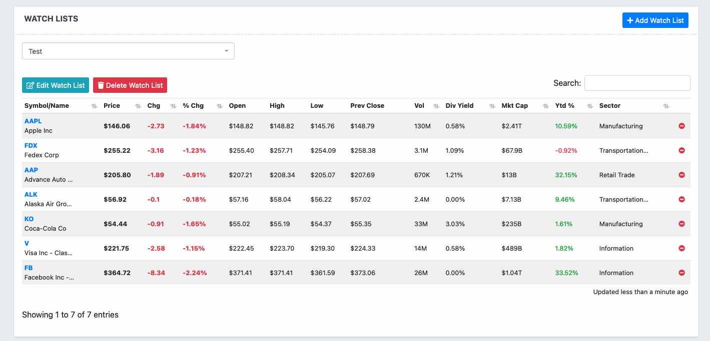

## Stock Track
Track NYSE and NASADQ Stock prices and ratings.
- Demo - [https://stock-track1.herokuapp.com/](https://stock-track1.herokuapp.com/)

## Build status
[](https://app.codeship.com/projects/446910)

## Tech/framework used
<b>Built with</b>
- [Ruby](https://www.ruby-lang.org) - 2.7.1
- [Rails](https://rubyonrails.org/) - 5.2.1
- [PostgreSQL](https://www.postgresql.org/) - 13.2
- [Elasticsearch](https://www.elastic.co/)
- [HighCharts](https://www.highcharts.com/) 
- [Bootstrap](https://getbootstrap.com/) - 4.6
- [Redis](https://redis.io/)

## Features
- Stock Watch Lists.
  
- Price Targets and Analyst Ratings from across the web.
  
- Compare Stocks
  

## Installation
1. Clone the repo.
```sh
$ git clone https://github.com/bTspm/stock-track.git
```
2. Navigate to project directory.
```sh
$ cd stock-track
```
3. Set .env file with properties
- [IEX](Iexcloud.io/) - Register and get key
- [FinnHub](https://finnhub.io/) - Register and get key
- [Tradier](https://tradier.com/) - Register and get key
- [TwelveData](https://twelvedata.com/) - Register and get key
- [Searchly](https://www.searchly.com/) - Register and get key (For Elasticsearch) - Not Required for Local Env

```sh
ELASTICSEARCH_URL = ''
FINNHUB_KEY = ''
IEX_CLOUD_KEY = ''
TWELVE_DATA_KEY = ''
TRADIER_KEY = ''

IEX_SYMBOl_LOGO_PREFIX = ''
```
4. Run the migrations and seed the ref data.
```sh
$ bundle exec rake db:migrate
$ bundle exec rake db:seed
```
5. Start the Rails server.
```sh
$ bundle exec rails s
```
6. Start Redis Server.
```sh
$ brew services start redis
```
7. Start Sidekiq to process the background jobs.
```sh
$ bundle exec sidekiq
```
8. Navigate to [http//localhost:3000](http//localhost:3000)
## Tests
```sh
$ bundle exec rspec spec 
```
## License
[](https://opensource.org/licenses/MIT)


MIT License

Copyright (c) [2021] [bTspm]

Permission is hereby granted, free of charge, to any person obtaining a copy
of this software and associated documentation files (the "Software"), to deal
in the Software without restriction, including without limitation the rights
to use, copy, modify, merge, publish, distribute, sublicense, and/or sell
copies of the Software, and to permit persons to whom the Software is
furnished to do so, subject to the following conditions:

The above copyright notice and this permission notice shall be included in all
copies or substantial portions of the Software.

THE SOFTWARE IS PROVIDED "AS IS", WITHOUT WARRANTY OF ANY KIND, EXPRESS OR
IMPLIED, INCLUDING BUT NOT LIMITED TO THE WARRANTIES OF MERCHANTABILITY,
FITNESS FOR A PARTICULAR PURPOSE AND NONINFRINGEMENT. IN NO EVENT SHALL THE
AUTHORS OR COPYRIGHT HOLDERS BE LIABLE FOR ANY CLAIM, DAMAGES OR OTHER
LIABILITY, WHETHER IN AN ACTION OF CONTRACT, TORT OR OTHERWISE, ARISING FROM,
OUT OF OR IN CONNECTION WITH THE SOFTWARE OR THE USE OR OTHER DEALINGS IN THE
SOFTWARE.
